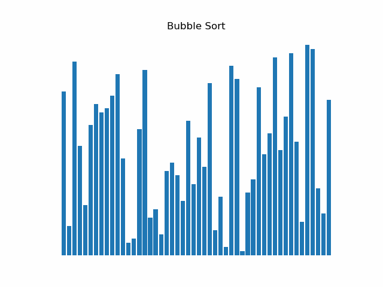
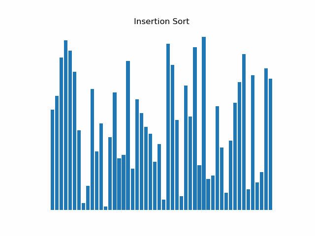
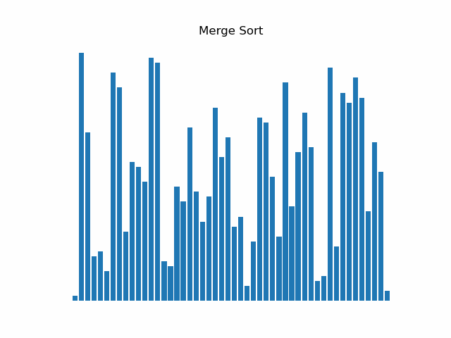
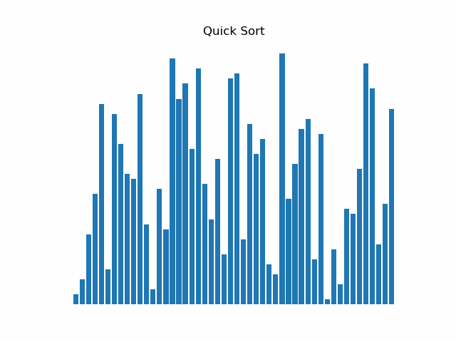
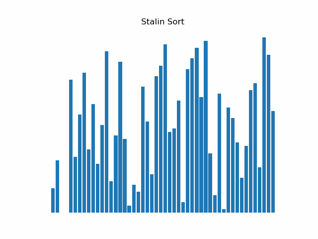

Sorted is a simple sort visualizer, built using python's matplotlib library.

## Bubble Sort

## Insertion Sort

## Merge Sort

## Quick Sort

## Bogo Sort

## Stalin Sort

### Setup

1. Install Python 3.8 or greater
2. Run `pip install -r requirements.txt` to install all requirements
3. Run `python sort.py`

### License

- MIT license
- Copyright 2020 © Dominic Too.
